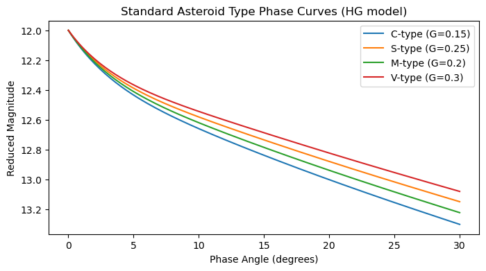
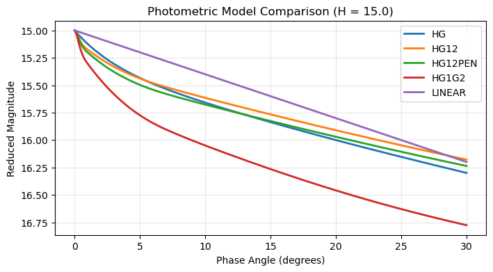
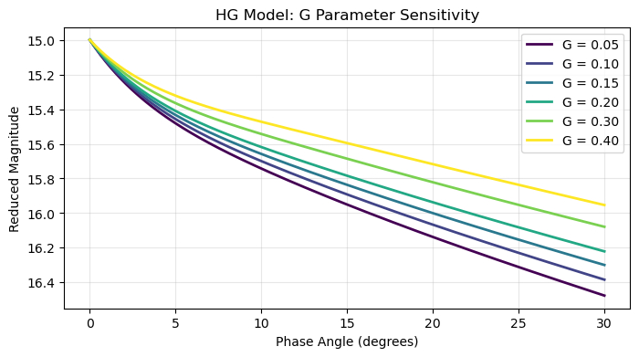
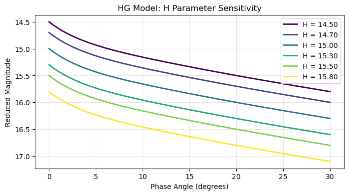
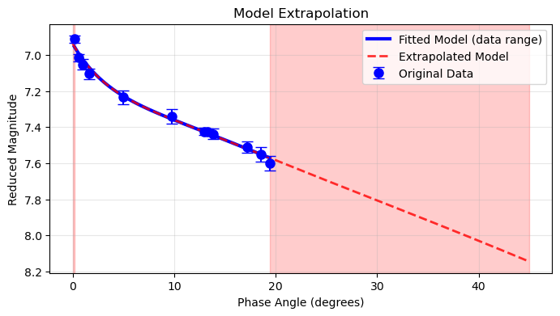

# Generate Models

## Overview

The `generateModel()` method creates magnitude values from model parameters, enabling:

- Smooth curves for plotting fitted models
- Synthetic datasets for testing
- Theoretical phase curves from literature values
- Model extrapolation beyond data range

## Method Signature

```python
generateModel(model, degrees=None)
```

**Parameters:**
- **model** (str): Model name ("HG", "HG1G2", "HG12", "HG12PEN", "LINEAR")
- **degrees** (array-like, optional): Phase angles. If None, uses object's angle array

**Returns:**
- Magnitude values (float or numpy array)

## Basic Usage

### From Fitted Parameters

```python
# After fitting a model
pc.fitModel(model="HG", method="trust-constr")

# Generate at original angles
model_mags = pc.generateModel(model="HG")
print("Model at original angles:", model_mags)

# Generate at new angles
new_angles = np.array([1, 5, 10, 15, 20, 25, 30])
extended_mags = pc.generateModel(model="HG", degrees=new_angles)
print("Model at extended angles:", extended_mags)
```
```console
Model at original angles: [6.95322579 6.99455516 7.02274888 7.06830039 7.22616926 7.35526372
 7.42522086 7.43249424 7.44442226 7.51929385 7.54999792 7.56988952]
Model at extended angles: [7.02428427 7.22788627 7.36022689 7.47084845 7.58344709 7.6956334
 7.80641673]
```

### Single Point Generation

```python
# Generate magnitude at specific angle
mag_at_10deg = pc.generateModel(model="HG", degrees=10.0)
print(f"Magnitude at 10°: {mag_at_10deg:.3f}")

# Generate at zero phase (absolute magnitude H)
h_magnitude = pc.generateModel(model="HG", degrees=0.0)
print(f"H parameter: {pc.params['H']:.3f}")
print(f"Magnitude at 0°: {h_magnitude:.3f}")  # Should match H
```
```console
Magnitude at 10°: 7.360
H parameter: 6.937
Magnitude at 0°: 6.937
```

## Theoretical Models

### From Literature Parameters

```python
def create_theoretical_model(model, phase_range, **params):
    """Create theoretical phase curve from literature parameters."""

    angles = np.linspace(phase_range[0], phase_range[1], 100)
    pc = PhaseCurve(angle=angles, **params)
    magnitudes = pc.generateModel(model=model)

    return angles, magnitudes

# Example: Create HG model from known parameters
angles, mags = create_theoretical_model(
    model="HG",
    phase_range=(0, 30),
    H=15.24,
    G=0.15
)

print(f"Generated {len(angles)} points from 0° to 30°")
```
```console
Generated 100 points from 0° to 30°
```

### Standard Asteroid Types

```python
def generate_standard_types():
    """Generate phase curves for standard asteroid taxonomic types."""

    # Typical slope parameters (G) per type
    standard_types = {
        'C-type': {'G': 0.15},  # Carbonaceous (dark, shallow slope)
        'S-type': {'G': 0.25},  # Silicaceous
        'M-type': {'G': 0.20},  # Metallic
        'V-type': {'G': 0.30}   # Basaltic (steeper slope)
    }

    # Use a single reference H (absolute magnitude)
    H_ref = 12.0

    phase_angles = np.linspace(0, 30, 150)
    models = {}

    for ast_type, params in standard_types.items():
        pc = PhaseCurve(angle=phase_angles, H=H_ref, **params)
        magnitudes = pc.generateModel(model="HG")
        models[ast_type] = {
            'angles': phase_angles,
            'magnitudes': magnitudes,
            'params': {'H': H_ref, **params}
        }

    return models

# Generate and plot
import matplotlib.pyplot as plt

models = generate_standard_types()

plt.figure(figsize=(8, 4))
for ast_type, data in models.items():
    plt.plot(data['angles'], data['magnitudes'],
             label=f"{ast_type} (G={data['params']['G']})")

plt.gca().invert_yaxis()
plt.xlabel('Phase Angle (degrees)')
plt.ylabel('Reduced Magnitude')
plt.title('Standard Asteroid Type Phase Curves (HG model)')
plt.legend()
plt.show()
```


## Model Comparisons

### Compare Different Models

```python
def compare_photometric_models(h_value=15.0):
    """Compare different models with same H value."""

    model_params = {
        'HG': {'H': h_value, 'G': 0.15},
        'HG12': {'H': h_value, 'G12': 0.30},
        'HG12PEN': {'H': h_value, 'G12': 0.30},
        'HG1G2': {'H': h_value, 'G1': 0.30, 'G2': 0.15},
        'LINEAR': {'H': h_value, 'beta': 0.04}
    }

    phase_angles = np.linspace(0, 30, 200)

    plt.figure(figsize=(8, 4))

    for model, params in model_params.items():
        pc = PhaseCurve(angle=phase_angles, **params)
        magnitudes = pc.generateModel(model=model)
        plt.plot(phase_angles, magnitudes, linewidth=2, label=model)

    plt.gca().invert_yaxis()
    plt.xlabel('Phase Angle (degrees)')
    plt.ylabel('Reduced Magnitude')
    plt.title(f'Photometric Model Comparison (H = {h_value})')
    plt.legend()
    plt.grid(True, alpha=0.3)
    plt.show()

# Usage
compare_photometric_models(h_value=15.0)
```



### Parameter Sensitivity

```python
def parameter_sensitivity(model="HG", base_params=None, vary_param='G'):
    """Analyze sensitivity to parameter variations."""

    if base_params is None:
        base_params = {'H': 15.0, 'G': 0.15}

    # Define parameter variations
    if vary_param == 'G':
        variations = [0.05, 0.10, 0.15, 0.20, 0.30, 0.40]
    elif vary_param == 'H':
        variations = [14.5, 14.7, 15.0, 15.3, 15.5, 15.8]
    else:
        variations = np.linspace(0.1, 0.4, 6)

    phase_angles = np.linspace(0, 30, 200)

    plt.figure(figsize=(8, 4))

    for i, var_value in enumerate(variations):
        # Create parameter set
        params = base_params.copy()
        params[vary_param] = var_value

        # Generate model
        pc = PhaseCurve(angle=phase_angles, **params)
        magnitudes = pc.generateModel(model=model)

        # Plot with color gradient
        color = plt.cm.viridis(i / (len(variations) - 1))
        plt.plot(phase_angles, magnitudes, color=color, linewidth=2,
                label=f'{vary_param} = {var_value:.2f}')

    plt.gca().invert_yaxis()
    plt.xlabel('Phase Angle (degrees)')
    plt.ylabel('Reduced Magnitude')
    plt.title(f'{model} Model: {vary_param} Parameter Sensitivity')
    plt.legend()
    plt.grid(True, alpha=0.3)
    plt.show()

# Usage examples
parameter_sensitivity(model="HG", vary_param='G')
parameter_sensitivity(model="HG", vary_param='H')
```





## Synthetic Datasets

### Generate Test Data

```python
def generate_synthetic_dataset(model, params, phase_angles, noise_level=0.02, seed=None):
    """Generate synthetic observational dataset with noise."""

    if seed is not None:
        np.random.seed(seed)

    # Generate perfect model
    pc = PhaseCurve(angle=phase_angles, **params)
    true_magnitudes = pc.generateModel(model=model)

    # Add observational noise
    noise = np.random.normal(0, noise_level, len(phase_angles))
    observed_magnitudes = true_magnitudes + noise

    # Create realistic uncertainties
    uncertainties = np.full_like(phase_angles, noise_level)
    uncertainties *= np.random.uniform(0.8, 1.2, len(phase_angles))

    return {
        'angles': phase_angles,
        'magnitudes': observed_magnitudes,
        'uncertainties': uncertainties,
        'true_magnitudes': true_magnitudes,
        'true_params': params
    }

# Generate test dataset
true_params = {'H': 15.234, 'G': 0.187}
test_angles = np.array([3., 7., 11., 16., 21., 26.])

synthetic_data = generate_synthetic_dataset(
    model="HG",
    params=true_params,
    phase_angles=test_angles,
    noise_level=0.03,
    seed=42
)

print("Synthetic dataset generated:")
print(f"True H: {true_params['H']:.3f}")
print(f"True G: {true_params['G']:.3f}")
print(f"Noise level: {0.03:.3f} mag")
```
```console
Synthetic dataset generated:
True H: 15.234
True G: 0.187
Noise level: 0.030 mag
```

### Parameter Recovery Testing

```python
def test_parameter_recovery(model, true_params, n_datasets=50):
    """Test parameter recovery accuracy with synthetic data."""

    test_angles = np.array([5, 10, 15, 20, 25])
    recovered_params = []

    for i in range(n_datasets):
        # Generate synthetic dataset
        synthetic = generate_synthetic_dataset(
            model=model,
            params=true_params,
            phase_angles=test_angles,
            noise_level=0.02,
            seed=i
        )

        # Attempt to fit
        try:
            pc = PhaseCurve(
                angle=synthetic['angles'],
                magnitude=synthetic['magnitudes'],
                magnitude_unc=synthetic['uncertainties']
            )
            pc.fitModel(model=model, method="trust-constr")
            recovered_params.append(pc.params.copy())
        except:
            continue

    # Analyze results
    if not recovered_params:
        print("No successful fits!")
        return

    print(f"Parameter Recovery Test ({model} model):")
    print(f"Successful fits: {len(recovered_params)}/{n_datasets}")
    print()

    for param in true_params:
        recovered_values = [rp[param] for rp in recovered_params]
        true_value = true_params[param]

        mean_recovered = np.mean(recovered_values)
        std_recovered = np.std(recovered_values)
        bias = mean_recovered - true_value

        print(f"{param}:")
        print(f"  True value: {true_value:.4f}")
        print(f"  Mean recovered: {mean_recovered:.4f}")
        print(f"  Standard deviation: {std_recovered:.4f}")
        print(f"  Bias: {bias:.4f}")
        print()

# Test recovery
true_params = {'H': 15.234, 'G': 0.187}
test_parameter_recovery("HG", true_params)
```
```console
Parameter Recovery Test (HG model):
Successful fits: 50/50

H:
  True value: 15.2340
  Mean recovered: 15.2441
  Standard deviation: 0.0233
  Bias: 0.0101

G:
  True value: 0.1870
  Mean recovered: 0.1982
  Standard deviation: 0.0248
  Bias: 0.0112
```

## Model Extrapolation

### Extend Beyond Data Range

```python
def extrapolate_model(pc, extended_range=(0, 60)):
    """Extrapolate fitted model to extended phase angles."""

    if not pc.fitting_status:
        print("Fit a model first")
        return

    original_range = (np.min(pc.angle), np.max(pc.angle))
    extended_angles = np.linspace(extended_range[0], extended_range[1], 300)
    extended_mags = pc.generateModel(model=pc.fitting_model, degrees=extended_angles)

    plt.figure(figsize=(8, 4))

    # Plot original data
    plt.errorbar(pc.angle, pc.magnitude, yerr=pc.magnitude_unc,
                fmt='o', capsize=5, markersize=8, color='blue',
                label='Original Data', zorder=10)

    # Plot fitted model in original range
    original_angles = np.linspace(original_range[0], original_range[1], 100)
    original_model = pc.generateModel(model=pc.fitting_model, degrees=original_angles)
    plt.plot(original_angles, original_model, 'b-', linewidth=3,
            label='Fitted Model (data range)')

    # Plot extrapolated model
    plt.plot(extended_angles, extended_mags, 'r--', linewidth=2,
            label='Extrapolated Model', alpha=0.8)

    # Highlight extrapolation regions
    if extended_range[0] < original_range[0]:
        plt.axvspan(extended_range[0], original_range[0], alpha=0.2, color='red')
    if extended_range[1] > original_range[1]:
        plt.axvspan(original_range[1], extended_range[1], alpha=0.2, color='red')

    plt.gca().invert_yaxis()
    plt.xlabel('Phase Angle (degrees)')
    plt.ylabel('Reduced Magnitude')
    plt.title('Model Extrapolation')
    plt.legend()
    plt.grid(True, alpha=0.3)
    plt.show()

    return extended_angles, extended_mags

# Usage after fitting
extended_angles, extended_mags = extrapolate_model(pc, extended_range=(0, 45))
```


